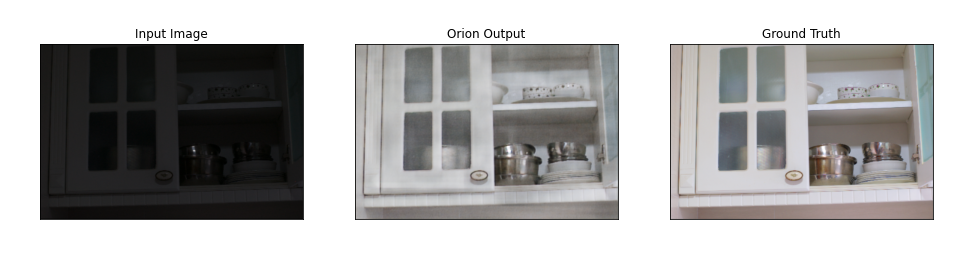

# Orion
Low-Light Image Enhancement by Fully-Convolutional Network

In this project we try to tackle the task of enhancement of low light images. We know that images taken on the phones are usually blurry and also the exposure is for a very short amount of time which may cause the actual image to be noisy. In the past there has been techniques used for debluring and denoising the images but most of them have been application specific. In this project we have proposed a model (dubbed as Orion), that learns on the LOw-Light dataset (LOL) containing low light images and corresponding normal light images. The model learns to enhance or improve the lighting of the low light images to look as the normal light images. The model is a fully-convolutional neural network pipeline that enhances the lighting conditions of the image provided to it.

Requirements:
-Python==3.6
-Tensorflow
-Keras
-skimage
-matplotlib
-numpy

To train the model. Run $train.py$ with the dataset in 'Datasets/LOLdataset/' or change the variable in the file accordingly. The model will train and save the best model as 'orion_final.h5'.

To test the model, download the trained model from [here]( https://drive.google.com/file/d/1Qk7R7IJQahPMgzW02fRPd9ujaNc5TlFr/view?usp=sharing) and place it in the repo. Run $test.py$ and it will show the test PSNR and SSIM along with a sample output as shown below.

